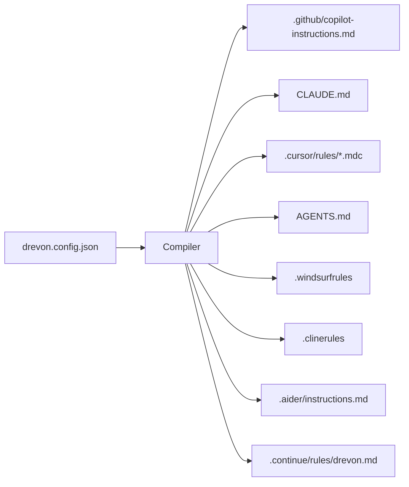
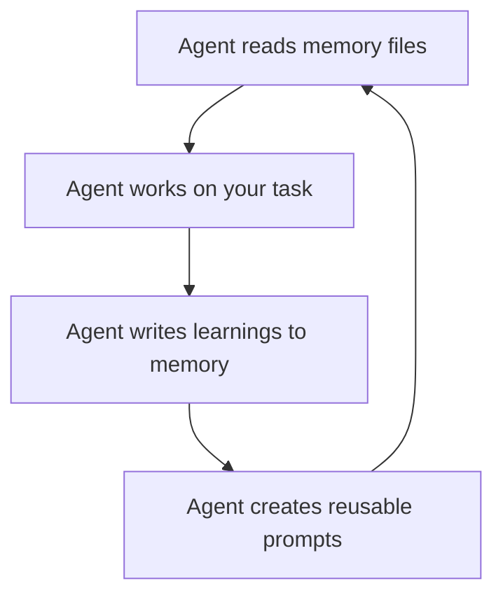

## Architecture Overview

Drevon follows a simple but powerful pattern: **single source of truth → compile → native agent configs**.

## The Compilation Pipeline

When you run `drevon sync`, the following happens:

<Steps>
  <Step title="Load Config">
    Reads `drevon.config.json` and validates it against the Zod schema. If the config is invalid, you get clear error messages.
  </Step>
  <Step title="Resolve Skills">
    Reads `skills-lock.json` to find all installed skills and their descriptions. Skills are injected as a formatted table into each agent's instructions.
  </Step>
  <Step title="Iterate Enabled Agents">
    For each agent with `enabled: true`, the compiler instantiates the appropriate adapter.
  </Step>
  <Step title="Generate Content">
    Each adapter builds the agent-specific config by combining:
    - **Identity** — role, description, posture
    - **Memory protocol** — instructions for reading/writing memory files
    - **Custom instructions** — your project-specific rules
    - **Skills** — installed skill descriptions and usage instructions
    - **Workspace rules** — workspace organization (hub mode)
    - **Prompts** — available workflow templates
  </Step>
  <Step title="Diff & Write">
    The compiler compares generated content against existing files. **Only changed files are written**, avoiding unnecessary Git noise.
  </Step>
</Steps>

## The Adapter Pattern

Each supported agent has a dedicated **adapter** that knows its native config format:

| Agent | Adapter | Format |
|-------|---------|--------|
| GitHub Copilot | `CopilotAdapter` | Single markdown file |
| Claude Code | `ClaudeCodeAdapter` | Single markdown with `allowedCommands` |
| Cursor | `CursorAdapter` | Multiple `.mdc` files with YAML frontmatter |
| OpenAI Codex | `CodexAdapter` | Single markdown file |
| Windsurf | `WindsurfAdapter` | Single markdown file |
| Cline | `ClineAdapter` | Single markdown file |
| Aider | `AiderAdapter` | Markdown + optional YAML config |
| Continue.dev | `ContinueAdapter` | Single markdown file |

All adapters extend a shared `BaseAdapter` class that provides common content generation methods. This means every agent receives the same instructions, just formatted differently.

<Tip>
  Cursor's adapter is the most complex — it generates multiple `.mdc` files with YAML frontmatter, supporting glob-targeted conditional rules that only activate for specific file types.
</Tip>

## Write-Only-If-Changed

The compiler intelligently diffs each generated file against the existing one on disk. This means:

- Running `drevon sync` repeatedly is safe — it won't create noisy Git diffs
- The output tells you exactly what was `created`, `updated`, or `unchanged`
- You can commit agent config files to Git without churn

## The Self-Evolution Loop

Drevon doesn't just generate static config files — it creates a **feedback loop** where agents improve over time:

1. **Session start** — agents read all memory files to restore context
2. **During work** — agents make decisions informed by past context
3. **Session end** — agents write back what they learned (decisions, patterns, discoveries)
4. **Over time** — repeated workflows get extracted into reusable prompts

This creates compounding returns: the more you use your workspace, the more useful it becomes.
