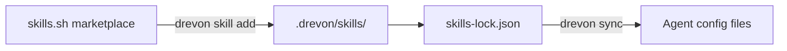

## Overview

Skills are pluggable knowledge modules that extend what your AI agents can do. They're sourced from the [skills.sh](https://skills.sh) marketplace — a community-driven ecosystem of agent capabilities.

When you install a skill, its instructions are automatically injected into every enabled agent's config file.

## How Skills Work



1. **Install** — `drevon skill add` downloads the skill to `.drevon/skills/`
2. **Register** — The skill is recorded in `skills-lock.json`
3. **Compile** — On `drevon sync`, skills appear as a table in each agent's instructions
4. **Use** — Agents read skill descriptions and follow their `SKILL.md` instructions

## Installing Skills

```bash
# From skills.sh — owner/repo format
drevon skill add browser-use/browser-use

# With skill name (for multi-skill repos)
drevon skill add owner/repo/skill-name

# Copy-paste from skills.sh website (auto-sanitized)
drevon skill add "npx skills add browser-use/browser-use --skill browser-use"
```

<Tip>
  You can copy-paste the install command directly from [skills.sh](https://skills.sh) — Drevon automatically strips the `npx skills add` prefix and `--skill` flags.
</Tip>

## Managing Skills

```bash
# List installed skills
drevon skill list

# Remove a skill
drevon skill remove browser-use

# Re-sync skills into agent configs
drevon skill sync
```

## The Lock File

`skills-lock.json` tracks all installed skills:

```json
{
  "skills": [
    {
      "name": "find-skills",
      "description": "Helps users discover and install agent skills",
      "source": "bundled",
      "path": ".drevon/skills/find-skills",
      "hash": "abc123",
      "installedAt": "2026-02-28T10:00:00Z"
    },
    {
      "name": "browser-use",
      "description": "Control web browsers for research and testing",
      "source": "browser-use/browser-use",
      "path": ".drevon/skills/browser-use",
      "hash": "def456",
      "installedAt": "2026-02-28T12:00:00Z"
    }
  ]
}
```

<Note>
  Commit `skills-lock.json` to Git. This ensures teammates get the same skills when they run `drevon sync`.
</Note>

## Bundled Skills

Every Drevon workspace comes with one pre-installed skill:

### find-skills
A comprehensive guide that helps agents discover, evaluate, and install new skills from the skills.sh ecosystem. It teaches agents how to:
- Search for skills by category
- Evaluate skill quality and compatibility
- Install skills via the Drevon CLI
- Recommend skills based on the current task

## Skill Packs

Drevon includes curated skill collections for common use cases:

| Pack | Skills Included | Use Case |
|------|---------------|----------|
| **essentials** | browser-use, pdf, skill-creator | Core capabilities |
| **web-dev** | tailwind-design-system, ui-ux-pro-max, web-design-guidelines, seo-audit | Frontend development |
| **content** | copywriting, pptx, remotion-best-practices | Content creation |
| **ai-tools** | agent-tools (150+ models via inference.sh) | AI/ML workflows |

<Info>
  Skill packs are defined in the codebase and will be installable via CLI in a future release.
</Info>

## Skill Anatomy

Each skill is a directory containing a `SKILL.md` file:

```
.drevon/skills/
└── my-skill/
    └── SKILL.md
```

The `SKILL.md` file contains:
- **Description** — What the skill does
- **When to use** — Trigger conditions for the agent
- **Instructions** — Detailed guidance for the agent
- **Examples** — Usage patterns

## How Skills Appear in Agent Configs

Installed skills are rendered as a structured section in each agent's instruction file:

```markdown
## Installed Skills

| Skill | Description |
|-------|-------------|
| find-skills | Helps users discover and install agent skills |
| browser-use | Control web browsers for research and testing |

> **IMPORTANT:** To install new skills, always use `drevon skill add <source>`
> Drevon tracks skills in `.drevon/skills/` and keeps all agent configs in sync.
```

Agents also receive a reference to each skill's `SKILL.md` file path, which they can read for detailed instructions when the skill is relevant to the current task.

## Popular Skills

Browse popular skills at [skills.sh](https://skills.sh):

| Skill | Source | Description |
|-------|--------|-------------|
| browser-use | `browser-use/browser-use` | Browser automation for research |
| pdf | `nicobailon/pdf` | PDF reading and manipulation |
| copywriting | `coreyhaines31/marketingskills` | Conversion copywriting |
| remotion | `florentinmayer/remotion` | Video creation in React |
